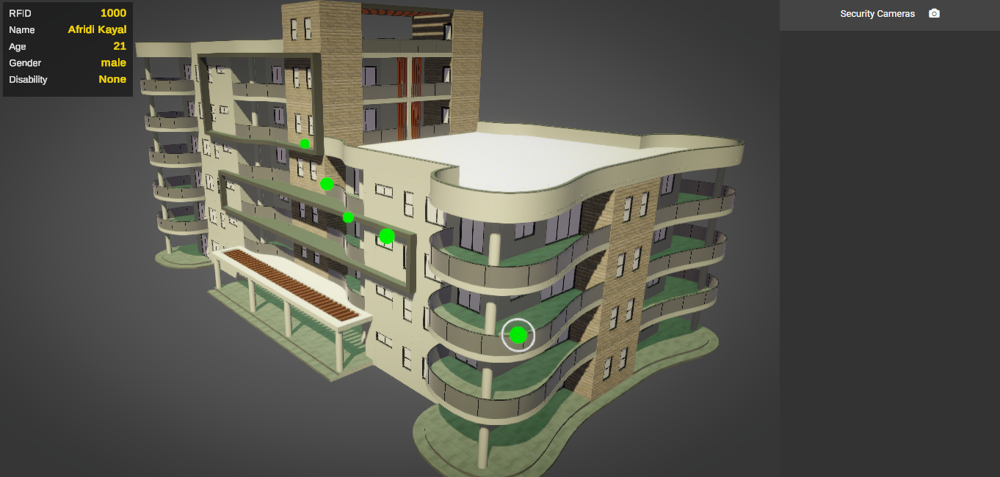

<h1 class="center">Building RFID Security System</h1>

    

## Motivation

This problem statement was given in Hackwithinfy 2020 hackathon. I liked the idea very much and wanted to make my own simulation.

The problem statement:

Design an application which can be used to view 3D model of a building showing the locations of visitors.
Differently abled people must be highlighted in case of emergency.

**Note:** This is just for simulation purpose but, due to the independent nature of the modules, the project can be transformed into a realtime application.

## Tools used

- NodeJs with socket.io and express server for backend.
- HTML, CSS, Javascript for frontend - (Data Entry).
- Unity 3D, and the above for frontend - (3D View).
- Python 3 with OpenCV and Keras (Fire detection) for rfid and camera clients.
- MongoDB for information storage.

## A brief overview

The base application consists of a backend server and two clients written in python that simulate the behaviour of Cameras and RFID Trackers (Switch to *clients* branch). There are two portals one for adding a visitor and the other for removing. An administrator view can be accessed through the web browser which shows the 3D scenes. The paths are dicussed below:

    // To add a visitor and get token
    GET /visitor/add

    // To remove a visitor by token
    GET /visitor/remove

    // To view the admin page
    GET /admin

Visitors can a be added using the **Add Page**. They appear in the admin view as they get added. Remove them using **Remove Page**.

**Note:** RFID Client must be active for adding visitors. This will be prompted if inactive while adding visitors. It is important for simulating the visitor's location with realtime updates.

Camera clients can be used to add security cameras to the scene which are capable of detecting fire. Webcam is used to simulate the behaviour. Cameras should have unique ID. Refer to the *clients* branch's readme for more information on how to setup the cameras.

## Starting the project

**NodeJs** is required (Made in *v12.13.0*).

To install the dependencies:

    npm install

Create a **.env** file in the root directory and include these keys:

    MONGO_URL=<Mongo Connection String>
    PORT=<Server Port>

Compile typescript to javascript + copy views and then start. A handy script compile is provided to setup the **./dist** folder:

    npm run-script compile
    npm start

## Launch application

RFID Client must be running before adding visitors. Switch to *client* branch for more information.

Use a web browser (Preferrably Google Chrome) to launch the respective paths as listed above.